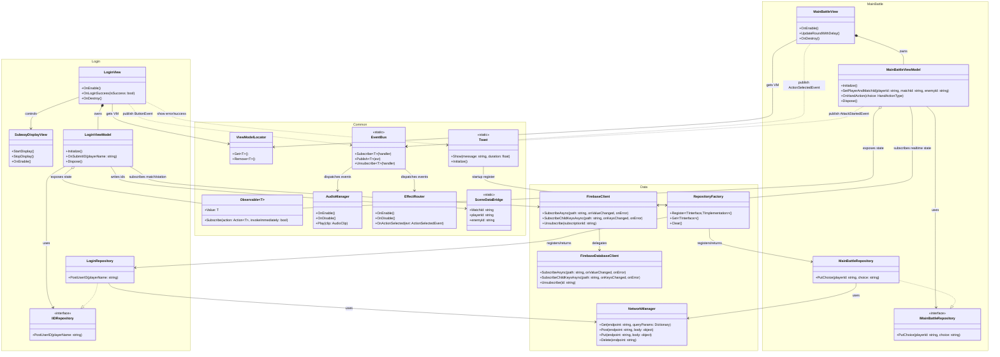

# UML Class Diagram (Code-based)

```mermaid
classDiagram
direction TB

namespace Login {
  class LoginView {
    +OnEnable()
    +OnLoginSuccess(isSuccess: bool)
    +OnDestroy()
  }

  class SubwayDisplayView {
    +StartDisplay()
    +StopDisplay()
    +OnEnable()
  }

  class LoginViewModel {
    +Initialize()
    +OnSubmitID(playerName: string)
    +Dispose()
  }

  class IIDRepository {
    <<interface>>
    +PostUserID(playerName: string)
  }

  class LoginRepository {
    +PostUserID(playerName: string)
  }
}

namespace MainBattle {
  class MainBattleView {
    +OnEnable()
    +UpdateRoundWithDelay()
    +OnDestroy()
  }

  class MainBattleViewModel {
    +Initialize()
    +SetPlayerAndMatchId(playerId: string, matchId: string, enemyId: string)
    +OnHandAction(choice: HandActionType)
    +Dispose()
  }

  class IMainBattleRepository {
    <<interface>>
    +PutChoice(playerId: string, choice: string)
  }

  class MainBattleRepository {
    +PutChoice(playerId: string, choice: string)
  }
}

namespace Data {
  class NetworkManager {
    +Get(endpoint: string, queryParams: Dictionary)
    +Post(endpoint: string, body: object)
    +Put(endpoint: string, body: object)
    +Delete(endpoint: string)
  }

  class FirebaseClient {
    +SubscribeAsync(path: string, onValueChanged, onError)
    +SubscribeChildKeysAsync(path: string, onKeysChanged, onError)
    +Unsubscribe(subscriptionId: string)
  }

  class FirebaseDatabaseClient {
    +SubscribeAsync(path: string, onValueChanged, onError)
    +SubscribeChildKeysAsync(path: string, onKeysChanged, onError)
    +Unsubscribe(id: string)
  }

  class RepositoryFactory {
    +Register~TInterface,TImplementation~()
    +Get~TInterface~()
    +Clear()
  }
}

namespace Common {
  class ViewModelLocator {
    +Get~T~()
    +Remove~T~()
  }

  class Observable~T~ {
    +Value: T
    +Subscribe(action: Action~T~, invokeImmediately: bool)
  }

  class EventBus {
    <<static>>
    +Subscribe~T~(handler)
    +Publish~T~(evt)
    +Unsubscribe~T~(handler)
  }

  class AudioManager {
    +OnEnable()
    +OnDisable()
    +Play(clip: AudioClip)
  }

  class EffectRouter {
    +OnEnable()
    +OnDisable()
    +OnActionSelected(evt: ActionSelectedEvent)
  }

  class SceneDataBridge {
    <<static>>
    +MatchId: string
    +playerId: string
    +enemyId: string
  }

  class Toast {
    <<static>>
    +Show(message: string, duration: float)
    +Initialize()
  }
}

LoginView *-- LoginViewModel : owns
LoginView --> SubwayDisplayView : controls
LoginView --> ViewModelLocator : gets VM
LoginView ..> Toast : show error/success
LoginView ..> EventBus : publish ButtonEvent

LoginViewModel --> IIDRepository : uses
LoginRepository ..|> IIDRepository
LoginRepository --> NetworkManager : uses
LoginViewModel --> FirebaseClient : subscribes match/station
LoginViewModel --> SceneDataBridge : writes ids
LoginViewModel o-- Observable~T~ : exposes state

MainBattleView *-- MainBattleViewModel : owns
MainBattleView --> ViewModelLocator : gets VM
MainBattleView ..> EventBus : publish ActionSelectedEvent

MainBattleViewModel --> IMainBattleRepository : uses
MainBattleRepository ..|> IMainBattleRepository
MainBattleRepository --> NetworkManager : uses
MainBattleViewModel --> FirebaseClient : subscribes realtime state
MainBattleViewModel ..> EventBus : publish AttackStartedEvent
MainBattleViewModel o-- Observable~T~ : exposes state

FirebaseClient --> FirebaseDatabaseClient : delegates
RepositoryFactory --> LoginRepository : registers/returns
RepositoryFactory --> MainBattleRepository : registers/returns
Toast --> RepositoryFactory : startup register

EventBus --> AudioManager : dispatches events
EventBus --> EffectRouter : dispatches events
```

