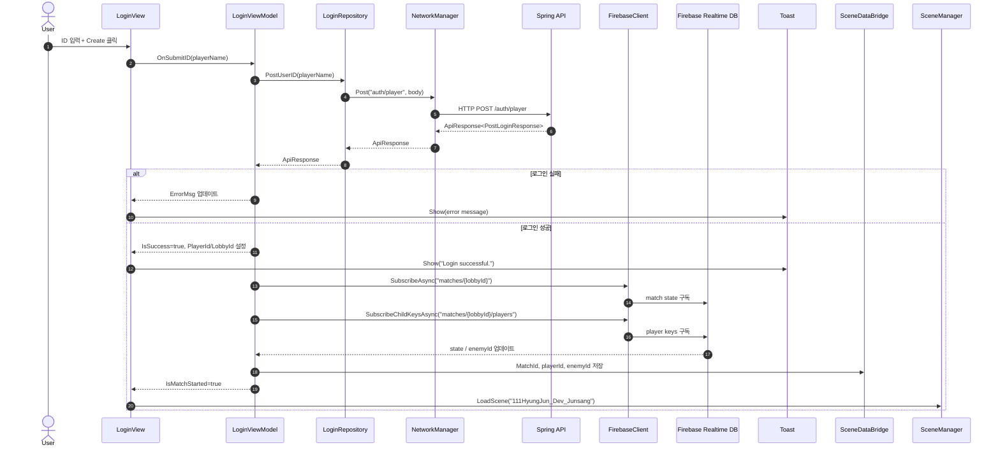
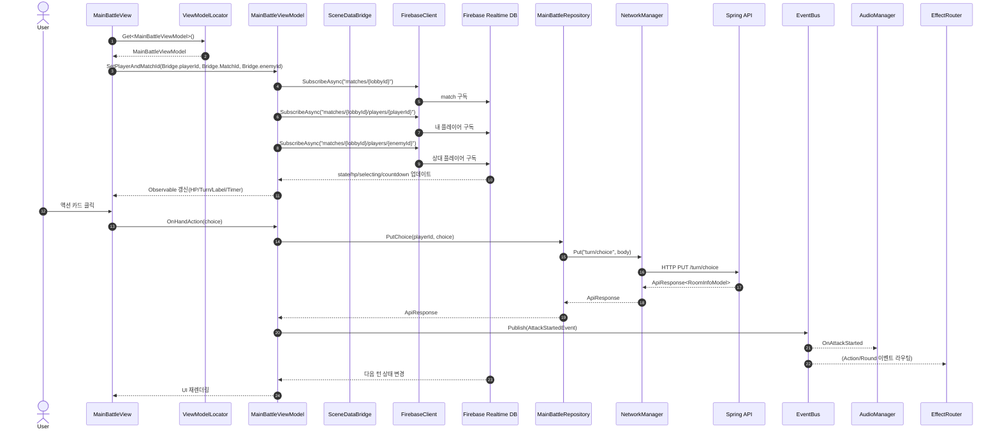

# Sequence Diagrams (Split)

## 1) Login Part

```mermaid
sequenceDiagram
  autonumber
  actor User
  participant LV as LoginView
  participant LVM as LoginViewModel
  participant LR as LoginRepository
  participant NM as NetworkManager
  participant API as Spring API
  participant FBC as FirebaseClient
  participant RTDB as Firebase Realtime DB
  participant Toast as Toast
  participant Bridge as SceneDataBridge
  participant Scene as SceneManager

  User->>LV: ID 입력 + Create 클릭
  LV->>LVM: OnSubmitID(playerName)
  LVM->>LR: PostUserID(playerName)
  LR->>NM: Post("auth/player", body)
  NM->>API: HTTP POST /auth/player
  API-->>NM: ApiResponse<PostLoginResponse>
  NM-->>LR: ApiResponse
  LR-->>LVM: ApiResponse

  alt 로그인 실패
    LVM-->>LV: ErrorMsg 업데이트
    LV->>Toast: Show(error message)
  else 로그인 성공
    LVM-->>LV: IsSuccess=true, PlayerId/LobbyId 설정
    LV->>Toast: Show("Login successful.")
    LVM->>FBC: SubscribeAsync("matches/{lobbyId}")
    FBC->>RTDB: match state 구독
    LVM->>FBC: SubscribeChildKeysAsync("matches/{lobbyId}/players")
    FBC->>RTDB: player keys 구독
    RTDB-->>LVM: state / enemyId 업데이트
    LVM->>Bridge: MatchId, playerId, enemyId 저장
    LVM-->>LV: IsMatchStarted=true
    LV->>Scene: LoadScene("111HyungJun_Dev_Junsang")
  end
```

## 2) MainBattle Part

```mermaid
sequenceDiagram
  autonumber
  actor User
  participant MBV as MainBattleView
  participant VML as ViewModelLocator
  participant MBVM as MainBattleViewModel
  participant Bridge as SceneDataBridge
  participant FBC as FirebaseClient
  participant RTDB as Firebase Realtime DB
  participant MBR as MainBattleRepository
  participant NM as NetworkManager
  participant API as Spring API
  participant EBus as EventBus
  participant Audio as AudioManager
  participant FX as EffectRouter

  MBV->>VML: Get<MainBattleViewModel>()
  VML-->>MBV: MainBattleViewModel
  MBV->>MBVM: SetPlayerAndMatchId(Bridge.playerId, Bridge.MatchId, Bridge.enemyId)
  MBVM->>FBC: SubscribeAsync("matches/{lobbyId}")
  FBC->>RTDB: match 구독
  MBVM->>FBC: SubscribeAsync("matches/{lobbyId}/players/{playerId}")
  FBC->>RTDB: 내 플레이어 구독
  MBVM->>FBC: SubscribeAsync("matches/{lobbyId}/players/{enemyId}")
  FBC->>RTDB: 상대 플레이어 구독
  RTDB-->>MBVM: state/hp/selecting/countdown 업데이트
  MBVM-->>MBV: Observable 갱신(HP/Turn/Label/Timer)

  User->>MBV: 액션 카드 클릭
  MBV->>MBVM: OnHandAction(choice)
  MBVM->>MBR: PutChoice(playerId, choice)
  MBR->>NM: Put("turn/choice", body)
  NM->>API: HTTP PUT /turn/choice
  API-->>NM: ApiResponse<RoomInfoModel>
  NM-->>MBR: ApiResponse
  MBR-->>MBVM: ApiResponse
  MBVM->>EBus: Publish(AttackStartedEvent)
  EBus-->>Audio: OnAttackStarted
  EBus-->>FX: (Action/Round 이벤트 라우팅)
  RTDB-->>MBVM: 다음 턴 상태 변경
  MBVM-->>MBV: UI 재렌더링
```

