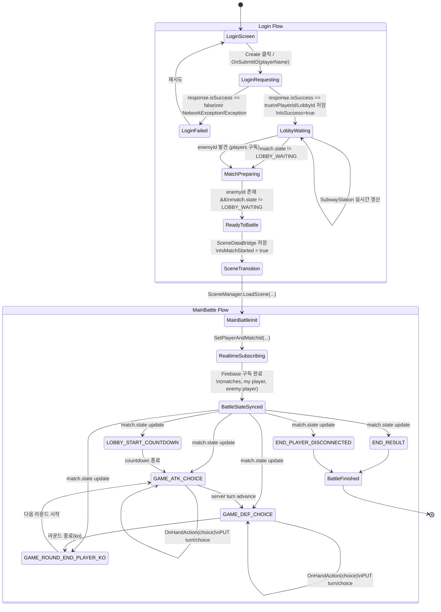

# State Diagram (Login -> MainBattle, code-based)

stateDiagram-v2
    direction TB

    [*] --> 입력_이름: 유저가 이름을 입력
    입력_이름 --> 클릭_로그인: 'Create' 버튼 클릭

    state "로그인 처리 (API)" as LoginAPI {
        클릭_로그인 --> 서버_요청: PostUserID(playerName)
        서버_요청 --> 결과_판단: 응답 수신
        
        결과_판단 --> 에러_표시: 실패 (isSuccess == false)
        에러_표시 --> 입력_이름: 다시 입력
        
        결과_판단 --> 정보_저장: 성공 (isSuccess == true)
        정보_저장 --> 로비_진입: PlayerId / MatchId 로컬 저장
    }

    state "매칭 및 데이터 동기화" as Matchmaking {
        로비_진입 --> 파이어베이스_구독: Realtime Database 연결
        
        state fork_state <<fork>>
        파이어베이스_구독 --> fork_state
        
        fork_state --> 지하철_정보_수신: 역 정보 업데이트
        fork_state --> 상대방_탐색: 상대방 ID 감시
        fork_state --> 매치_상태_감시: match.state 감시

        state join_state <<join>>
        지하철_정보_수신 --> join_state
        상대방_탐색 --> join_state
        매치_상태_감시 --> join_state
    }

    join_state --> 준비_완료: 상대방 존재 &&\n 방 상태 != Waiting
    준비_완료 --> 데이터_전달: SceneDataBridge에 정보 기록
    데이터_전달 --> 씬_전환: 로딩 및 배틀 씬 이동
    
    씬_전환 --> [*]